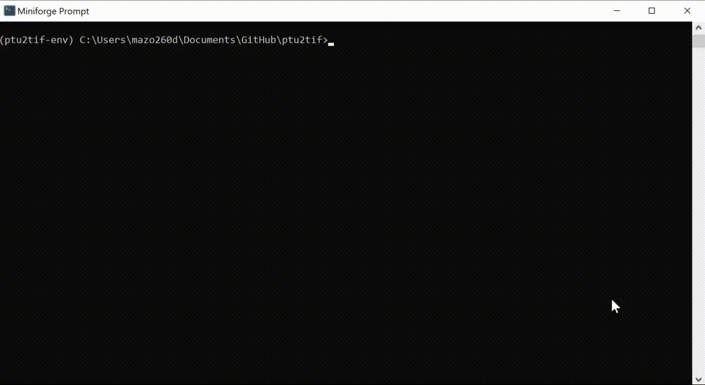

# ptu2tif

This repository hosts code for converting `.ptu` files to `.tif` files sequentially from a folder.

## Usage

Clone or download this repository locally. 

Then, create a conda environemnt with:

`conda env create -f https://github.com/zoccoler/ptu2tif/raw/main/env.yml`

Activate the environment with:

`conda activate ptu2tif-env`

From the activated environment, navigate to where the code is locally cloned and run the python script with (on Windows):

`python convert_ptu_to_tif.py`

Here is an example:

After it has finished, a new folder called `output_as_tif` should contain the output `.tif` files. This folder is created at the same place where the input data are.
